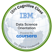
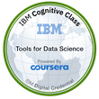
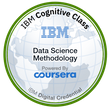
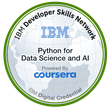
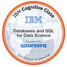
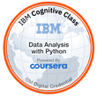
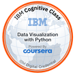

Hello Friend

Welcome to my Data Science repository.
With Python, of course.

Course Name  | Status | Description
------------- | ------------- | -------------
What is Data Science  |   |
Tools for Data Science  |   |
Data Science Methodology |   |
Python for Data Science, AI & Development |   | NumPy, WatsonSpeech, Pandas, Files
Python Project for Data Science |  Added later on |
Databases and SQL for Data Science with Python |  |
Data Analysis with Python |  |
Data Visualization with Python |  |
Machine Learning with Python | |
Applied Data Science Capstone | |

